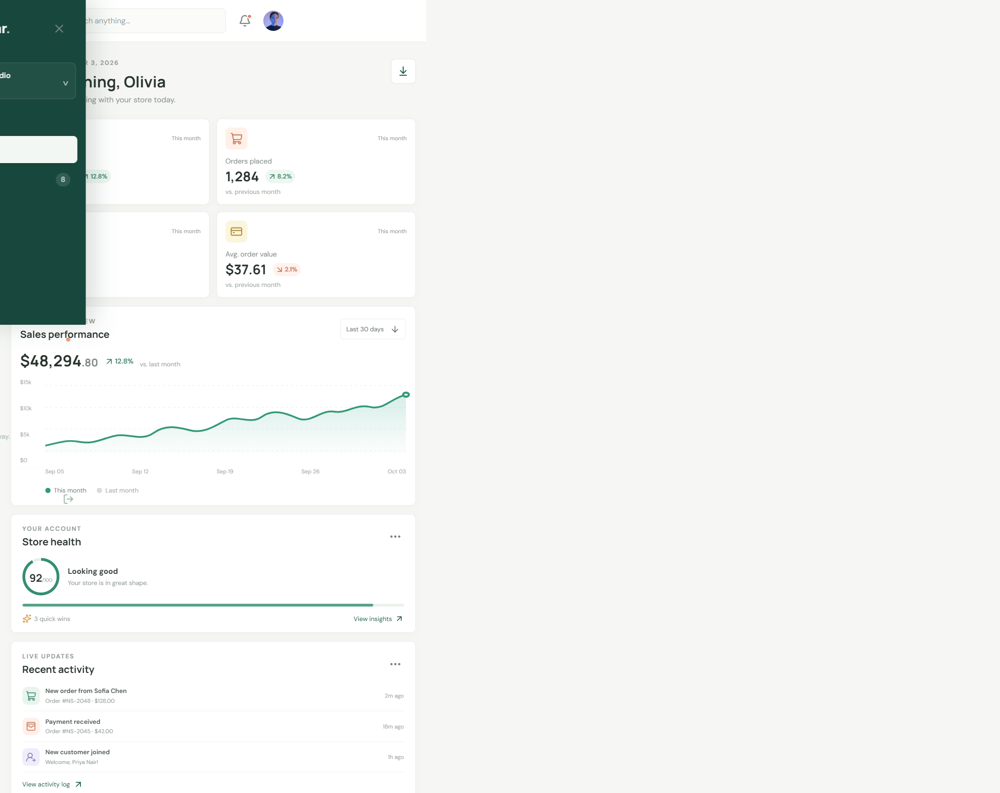
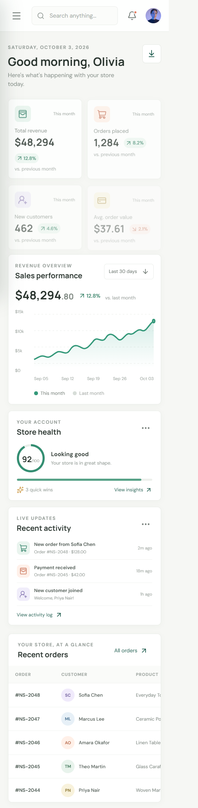

# Northstar Commerce Dashboard

A responsive store operations dashboard built for the Algoryx frontend internship, Week 1 task. It uses React, Vite, Lucide icons, reusable components, and a compact CSS design system.

## Run locally

```bash
npm install
npm run dev
```

Open the local URL printed by Vite. Production output can be checked with:

```bash
npm run lint
npm run build
npm run preview
```

## Dashboard features

- Responsive sidebar with workspace navigation and mobile drawer behavior.
- Top navigation with live order search and an interactive notifications popover.
- Four performance cards, a revenue trend chart, store health summary, and recent activity.
- Searchable recent-orders table with status labels and responsive horizontal scrolling.
- CSV export for the sample order report.
- Reduced-motion support and keyboard-visible focus states.

The dashboard currently uses local sample data in `src/data/dashboard.js`; connect that module to a real API before production use.

## Screenshots





## Project structure

```text
src/
  components/       Reusable dashboard UI
  data/             Sample metrics, orders, and activity
  App.jsx           Dashboard composition and interactions
  App.css           Responsive dashboard styles
```

## Portfolio submission checklist

- Source repository: [RohanSiripurapu/Algoryx-frontend](https://github.com/RohanSiripurapu/Algoryx-frontend).
- Claim the temporary Netlify preview below with a free Netlify account to keep it online; use `npm run build` and `dist` for future deployments.
- Capture desktop and mobile screenshots from the deployed dashboard and add them to the repository (for example, `screenshots/`).
- Publish a LinkedIn post with the live URL, repository link, screenshots, and a short summary of the React, responsive design, and reusable-component work.

### Live preview

[Northstar Commerce on Netlify](https://lighthearted-mousse-8aa14e.netlify.app/)

This is an unclaimed, password-protected Netlify Drop preview and expires about one hour after upload. Claim it in Netlify to make it persistent. The preview password is shown on the Netlify Drop confirmation page and is intentionally not stored in this repository.

### LinkedIn draft

> Week 1 of my Algoryx Frontend Internship: I built Northstar Commerce, a responsive React admin dashboard with reusable components, performance metrics, sales visualization, searchable orders, notifications, and CSV export. I used Vite, React, Lucide, and custom responsive CSS. Excited to keep building throughout the internship.
>
> Live demo: [Northstar Commerce](https://lighthearted-mousse-8aa14e.netlify.app/) · Source: [Algoryx-frontend](https://github.com/RohanSiripurapu/Algoryx-frontend)
>
> Replace the placeholders after publishing the repository and live demo.
